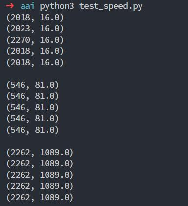

这里朴素地实现了三个用于求解时序序列 discords 的算法, 分别是 BruteForce, HOTSAX 以及 WAT.

没有任何依赖库, 请使用 python3 运行. 

# 文件说明

- trie.py: 实现了 Trie 的基本功能, add(index, s) 表示往 trie 里插入一个串 s, 该串对应原序列中的长度为 $n$ 的子串位置为 index. 
get_outter_order() 根据 trie 中每个叶子里 index 的数量, 从小到大返回这些 index. get_inner_order(leaf) 按和 leaf 的树上最近公共祖先的深度从大到小返回每个叶子上挂着的index. 

- haar.py: 里面有个函数 HAAR(s, order), 返回的是 $s$ 经过 Haar  wavelet Transform 之后的序列, 由于 HAAR 变换需要对 $2$ 的幂次对齐, 参数中的 order 指的是 Haar 变换的阶数, 如果 s 的长度不满 $2^{order}$, 那么会补零. 比如 HAAR([7, 3, 5, 1, 8], 3) = HAAR([7, 3, 5, 1, 8, 0, 0, 0], 3) = [3, 1, 1, 2, 2, 2, 4, 0] (这是论文中的例子). 函数 HAAR2CHAR(s, order) 即论文中的, 按照正态分布假设将实数转成字符. 

- paa.py: 里面有个函数 PAA(s, n, w), 指将长度为 $n$ 的序列 $s$ 离散化成长度为 $w$ 的字符序列, 实现的是 HOTSAX 里面那个 PAA 表示. 

- hotsax.py: 有个 HOTSAX 类, HOTSAX().calc(s, n, w), 表示寻找时序序列 s 中长度为 n 的 top-1 的 discords, 同时可以给出离散化时的参数 w. 

- wat.py: 有个 WAT 类, WAT().calc(s, order), 表示寻找时序序列 s 中长度为 $2^{order}$的 top-1 的 discords. 

- test_speed.py: 里面对三个数据集(汽车的速度)用了 5 个算法做测试, 分别是
  - bruteforce
  - WAT(s, 7), 即用 WAT 寻找 s 中长度为 $2^7=128$ 的 top-1 的 discords
  - HOTSAX(s, 128, 64), 即用 HOTSAX 寻找 s 中长度为 $128$ 的 top-1 的 discords, 离散化时参数 $w=64$
  - HOTSAX(s, 128, 32)
  - HOTSAX(s, 128, 16)
每个算法输出一个二元组 (x, y), x 表示找到的 discords, y 表示该 discords 到其最近不相交邻的距离. 结果如下

可以看出虽然找到的 discords 可能不一样, 但这几个算法算出的 discords 到最近邻的距离都是一样的. 